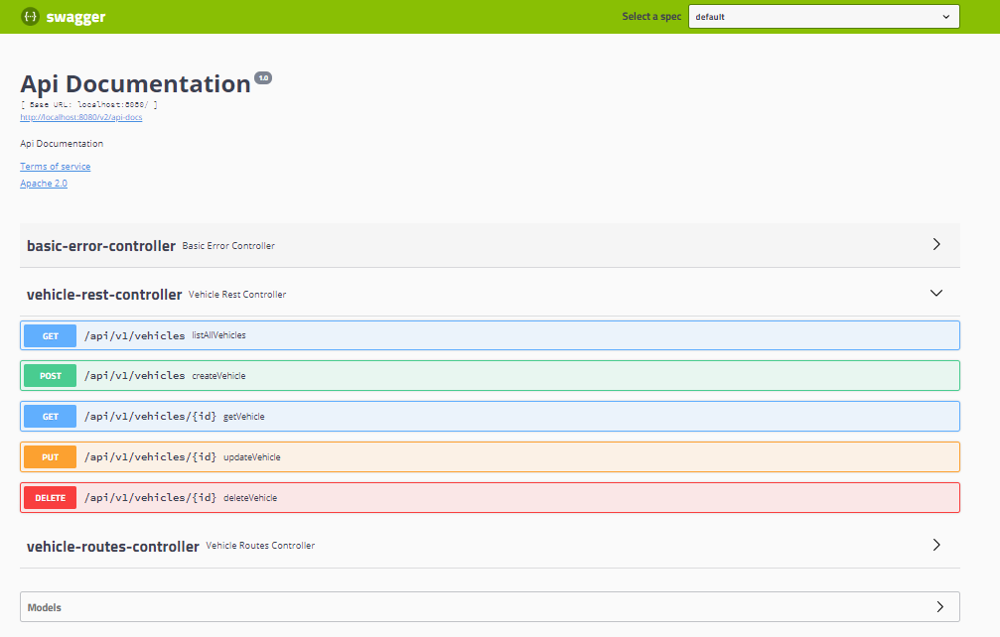

# My Web App

Develop a Spring Boot web application, using Thymeleaf view, embedded Tomcat and package it as an executable JAR file.


## Getting Started

### Prerequisites

- JDK 8 or later
- Maven 3.0 or later

## Maven Dependencies

In order to be able to work with Spring MVC, let's deal with the Maven dependencies first:

```
<dependency>
    <groupId>org.springframework</groupId>
    <artifactId>spring-webmvc</artifactId>
    <version>5.0.6.RELEASE</version>
<dependency>
```

To get the latest version of the library, have a look at [spring-webmvc on Maven Central.](https://mvnrepository.com/artifact/org.springframework/spring-webmvc)

SWAGGER Api Documentation : [http://localhost:8081/swagger-ui.html#/](http://localhost:8081/swagger-ui.html#/)

## Ressources

[Get started using Spring Boot to write Spring applications that just run](https://developer.ibm.com/tutorials/j-spring-boot-basics-perry)

Test Request with postman

